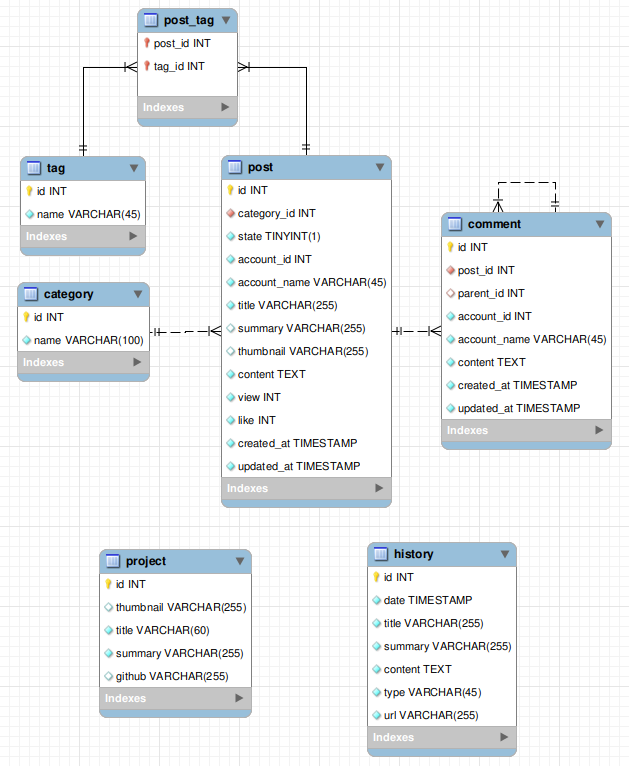

# blog_server_py

## 개요
> 파이썬 Fastapi로 블로그를 만들어 배포한다.
* 1 단계 : blog.varzeny.com 에 블로그 WAS 연결
* 2 단계 : [중앙인증서버](https://github.com/varzeny/Authorizaion_Server_Py.git) 와 연동
* 3 단계 : About Me 구현
* 4 단계 : Post 기능 구현
* 5 단계 : 댓글 기능 구현
    1. 그냥 댓글
    2. 대댓글

## 개발의의
* 나의 의견을 게시할 플랫폼 획득
* 종합적인 백엔드 실력 향상

## 환경
* 배포 : AWS(t2.micro)
* OS : Ubuntu 24.04
* 리버스 프록시 : Nginx
* 격리환경 : Docker
* 프레임워크 : FastAPI
* DB : MySQL

## 구조

## 상태
* 진행 : 
* 기간 : 2024.11.01
* 인원 : 1명
    * [varzeny(최화)](https://varzeny.com/aboutme)
        * 담당 : 전부
        * 기간 : 전부
